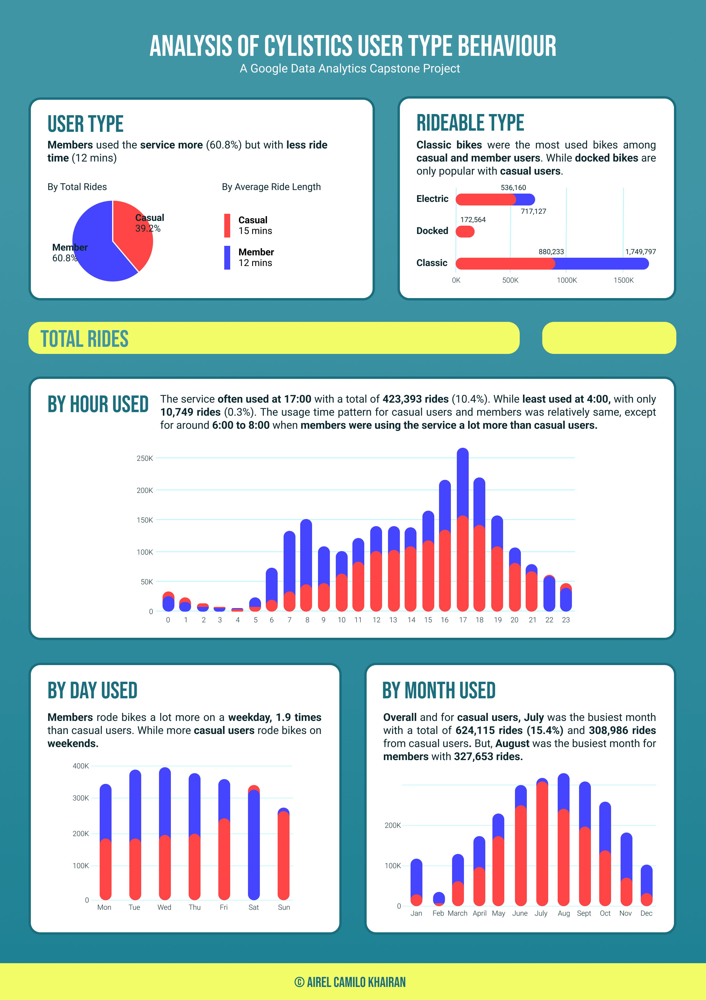
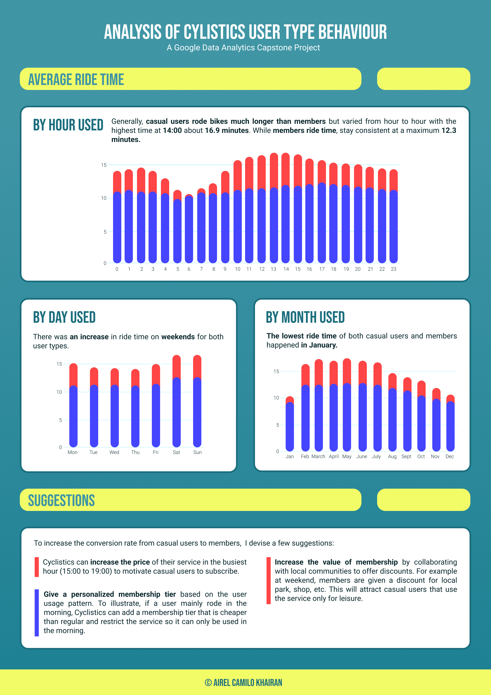

# My Submission for Google Data Analytics Capstone
I enrolled in the Google Data Analytics courses on 29 December 2022. After over 2 months, I finally advance to the last course, the Google Data Analytics Capstone. The capstone is comprised of two tracks. One has two case studies, while the latter is more freeing and lets you choose what you want to analyze. I choose the first one and picked the first case study which is **Case Study: How Does a Bike-Share Navigate Speedy Success?**

## Background
Cyclistic is a bike-share service launched in 2016 that has over 5,824 bicycles in 692 stations across Chicago. The bikes can be unlocked from one station and returned to any other station in the system at any time. Cyclistic offers a variety of pricing plans, single-ride and full-day passes for **casual riders** and annual membership to become **Cyclistic members**.

The marketing team concluded that annual members are more profitable than casual riders. They believe that a sizeable number of **casual riders can be converted into members**. So, they asked me, a junior data analyst, to **analyze how casual riders and annual members use Cyclistic bikes differently.** Thus, the marketing team can make design marketing strategies to convert casual riders to members based on that analysis. 

## Process
I downloaded the datasets from [this link](https://divvy-tripdata.s3.amazonaws.com/index.html) and used the data from the last 1 year, **February 2022 to January 2023**. After that, I reviewed each file to make sure there isn’t any inconsistency in the number of attributes. To my knowledge, there aren’t any inconsistencies because in each file there are exactly 13 attributes. Then, to analyze the data and make data visualization, I used tools such as:
1. **R** (Analyze data)
2. **Tableau** (Make data visualization)
3. **Figma** (Beautify the data visualization)

## R
For preparing the dataset and doing the analysis, first, I wanted to do it in Excel, but I change my mind and do it in R instead. I’m doing the preparation and analysis step in R because I wanted to challenge myself to use a programming language that I never used. But why not SQL you might be asked? Well in BigQuery, the maximum size of a file that I can upload is 100MB and some of the files surpass that. That’s why I used R, especially the RStudio Desktop version.

Now, this is the step I take to analyze the data in R:
1.	To make data analysis easier for me, I used the “tidyverse” package.
2.	Uploaded the 12 files to R using `list.files`
3. Add preprocessing to data, such as merging the data into one data frame called `tripdata` using `bind_rows`, drop rows with a null value and drop duplicate rows.
4.	To support my analysis, I created 4 new attributes called:
    *	`ride_length`   : Length of travel time for each ride.
    *	`hour_used`     : Start time the ride is used.
    *	`day_used`      : Day the ride is used.
    *	`month_used`    : Month the ride is used.
5.	After that, I cleaned the data by:
    * Drop unnecessary attributes `started_at`,`ended_at`, `start_station_name`, `end_station_name`, `start_station_id`, `end_station_id`, `start_lat`, `start_lng`, `end_lat`, and `end_lng`.
    * Find third quartile (Q3), interquartile range (IQR), and calculate reasonable upper boundary (RUB) to remove data with `ride_length` value above RUB (outlier).
6.	Next, I make a table for storing the total rides and average ride time for each category and group it by user type. The categories are:
    *	User type
    *   Rideable type
    *   Hour used
    *   Day used
    *   Month used. 
6.	I created five different tables instead of just one for readability. So, people can read the summary and have a good grasp of my analysis from the tables alone.
7. Lastly, save the tables to be used in Tableau for creating data visualization

You can see the full code [in here](analysis-code.Rmd).

## Tableau
After making an analysis, it's time to visualize it so the stakeholders can understand it more easily. To do that, I use Tableau Public Desktop version. 

In Tableau, I created a pie chart that visualizes the amount of casual vs member users. The relation between bike type and user type. Lastly, the correlation between total rides and average ride time with hour, day, and month used. You can see the full dashboard below or directly in Tableau [in here](https://public.tableau.com/views/GoogleDataAnalyticsCapstone_16778514224630/Dashboard1?:language=en-GB&:display_count=n&:origin=viz_share_link&:device=desktop).

## Figma
In addition to the dashboard in Tableau, I used Figma to create an infographic based on the visualization. But because I use Figma, it loses the interactivity that Tableau dashboard has. The infographic consists of two pages, the first page includes charts for total bikes along a summary of it and the second page includes charts for average ride time, a summary of it, and suggestions for the stakeholders. You can see the full infographic below. Or download the file [in here](infographic/Cyclistics%20Infographic.pdf).

## End
That's it for my analysis for the Google Data Analytics Capstone. I work on this project for more than a day and I'm grateful that I finally completed this capstone project. From this capstone, I learn a lot about my analysis process and also uncovered ways to improve it. In this project, I apply my knowledge of R and Tableau, but not SQL, so I would like to apply my SQL knowledge in future projects. Overall, I think this project was a great learning experience for me. That's all, I'm Airel signing off.